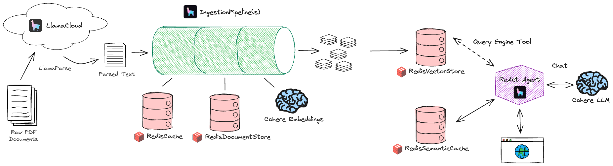

<h1 align="center">🦾 Agentic RAG Support Bot</h1>

## Overview
This Jupyter notebook is crafted to demonstrate the integration of [Redis](https://redis.io) and [LlamaIndex](https://docs.llamaindex.ai/en/stable/) for creating a **customer support chatbot** specifically tailored for Chevy vehicles. The system is powered by an "agentic RAG" architecture.

## Key Components

  
  
    

- **[Cohere](https://cohere.com)**: Serves as the language model and embeddings provider, ensuring that the chatbot understands and generates human-like text responses.
- **[Redis](https://redis.io)**: A versatile tool within our architecture, Redis functions as the document store, ingestion cache, vector store, chat history repository, and semantic cache.
- **[LlamaIndex](https://docs.llamaindex.ai/en/stable/)**: Acts as the central framework that ties together the entire system, enabling seamless integration with various services and tools to enhance functionality.

## Getting Started

To begin exploring the Agentic RAG Support Bot, you can launch this notebook in a Google Colab environment for a hands-on experience:

  

## Architecture Diagram
To provide a clearer picture of how each component interacts within the system, the architecture diagram can be explored below. This visual representation highlights document ingestion and inference with the agent.

  

## Additional Resources
For further reading and resources related to the technologies and approaches used in this project, consider the following links:
- [Redis Documentation](https://redis.io/docs/)
- [LlamaIndex Documentation](https://docs.llamaindex.ai/en/stable/)
- [LlamaIndex <> Redis Integration](https://docs.llamaindex.ai/en/latest/examples/vector_stores/RedisIndexDemo/)
- [Cohere Developer Portal](https://docs.cohere.ai/)

