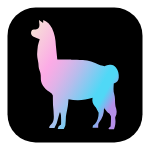
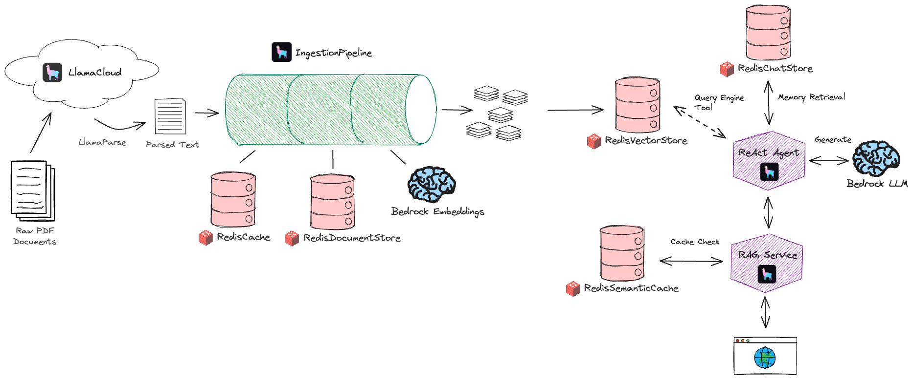

<h1 align="center">🦾 Agentic RAG with Redis, AWS Bedrock, and LlamaIndex</h1>

## Overview
This demo demonstrates the integration of [Redis](https://redis.io), [Amazon Bedrock](https://aws.amazon.com/bedrock/), and [LlamaIndex](https://docs.llamaindex.ai/en/stable/) for creating a **customer support chatbot** specifically tailored for Chevy vehicles. The system is powered by an "agentic RAG" architecture.

## Key Components

  
  
  

- **[Redis](https://redis.io)**: A versatile db within the architecture, Redis functions as the document store, ingestion cache, vector store, chat history store, and semantic cache.
- **[Amazon Bedrock](https://aws.amazon.com/bedrock/)**: Provides foundation models and embeddings models through the Bedrock API.
- **[LlamaIndex](https://docs.llamaindex.ai/en/stable/)**: Acts as the central framework that ties together the entire system, enabling seamless integration with various services and tools to enhance functionality.

## Getting Started

Launch this notebook in a Google Colab environment for a hands-on experience:

  

## Architecture Diagram
 This architecture highlights document ingestion and inference with the AI agent.

  

## Additional Resources
For further reading and resources related to the technologies and approaches used in this project, consider the following links:
- [Redis Documentation](https://redis.io/docs/)
- [LlamaIndex Documentation](https://docs.llamaindex.ai/en/stable/)
- [LlamaIndex <> Redis Integration](https://docs.llamaindex.ai/en/latest/examples/vector_stores/RedisIndexDemo/)
- [Amazon Bedrock Console](https://aws.amazon.com/bedrock/)
